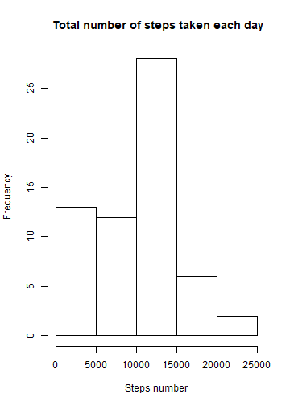
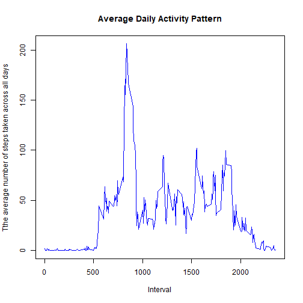
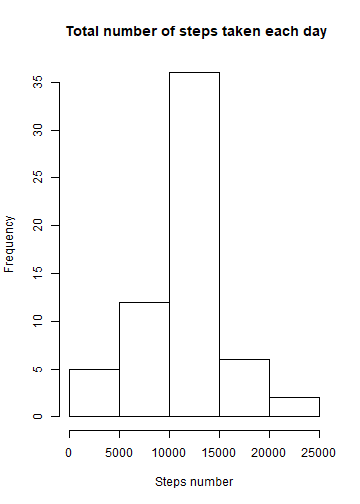
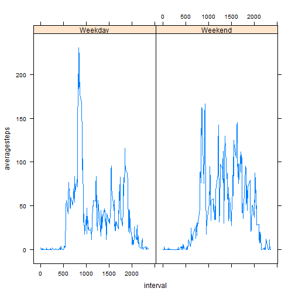

## Loading and preprocessing the data


```r
setwd("C:/Users/Administrator/Desktop/git/RepData_PeerAssessment1")
unzip("activity.zip")
act <- read.csv("./activity/activity.csv", header = T, stringsAsFactors = F, na.strings = "NA")
act$date <- as.Date(act$date,fformat = "%Y/%m/%d")
head(act, n = 6)
```

```
##   steps       date interval
## 1    NA 2012-10-01        0
## 2    NA 2012-10-01        5
## 3    NA 2012-10-01       10
## 4    NA 2012-10-01       15
## 5    NA 2012-10-01       20
## 6    NA 2012-10-01       25
```

## Calculate the mean total number of steps taken per day

1.Calculate the total number of steps taken per day

```r
library(plyr)
library(dplyr)
```

```
## 
## Attaching package: 'dplyr'
```

```
## The following objects are masked from 'package:plyr':
## 
##     arrange, count, desc, failwith, id, mutate, rename, summarise,
##     summarize
```

```
## The following objects are masked from 'package:stats':
## 
##     filter, lag
```

```
## The following objects are masked from 'package:base':
## 
##     intersect, setdiff, setequal, union
```

```r
library(magrittr)
df <- act %>% group_by(date) %>% summarise(tsteps = sum(steps,na.rm = T))
```

2.Make a histogram of the total number of steps taken each day

```r
hist(df$tsteps, main = " Total number of steps taken each day", xlab = "Steps number")
```



3.Calculate and report the mean and median of the total number of steps taken per day

```r
mean(df$tsteps)
```

```
## [1] 9354.23
```

```r
median(df$tsteps)
```

```
## [1] 10395
```

## Get the average daily activity pattern

1.Make a time series plot (i.e. type = "l") of the 5-minute interval (x-axis) and the average number of steps taken, averaged across all days (y-axis)

```r
df2 <- act %>% group_by(interval) %>% summarise(astep = mean(steps, na.rm = T))
plot(df2$interval, df2$astep, type = "l", xlab = "Interval", ylab = "Tthe average number of steps taken across all days ", main = "Average Daily Activity Pattern", col = "blue")
```



2.Find which 5-minute interval, on average across all the days in the dataset, contains the maximum number of steps

```r
(filter(df2, astep == max(df2$astep)))$interval
```

```
## [1] 835
```

## Imputing missing values

1.Calculate and report the total number of missing values in the dataset (i.e. the total number of rows with NAs)

```r
sum(is.na(act$steps))
```

```
## [1] 2304
```

2.Devise a strategy for filling in all of the missing values in the dataset.use the mean for that day.

```r
impute<-function(x){
        mean <- mean(x,na.rm = T)
        if(is.nan(mean)) {mean <- 0}
        mean <- round(mean,0)
        results<- replace(x,is.na(x),mean)
        results
}
```

3.Create a new dataset that is equal to the original dataset but with the missing data filled in

```r
imputeact <- ddply(act,  ~interval, transform, steps = impute(steps) )
head(imputeact)
```

```
##   steps       date interval
## 1     2 2012-10-01        0
## 2     0 2012-10-02        0
## 3     0 2012-10-03        0
## 4    47 2012-10-04        0
## 5     0 2012-10-05        0
## 6     0 2012-10-06        0
```

4.Make a histogram of the total number of steps taken each day and Calculate and report the mean and median total number of steps taken per day. These values differ from the estimates from the first part of the assignment. 

```r
df3 <- imputeact %>% group_by(date) %>% summarise(tsteps = sum(steps))
hist(df3$tsteps, main = " Total number of steps taken each day", xlab = "Steps number")
```




```r
median(df3$tsteps)
```

```
## [1] 10762
```

```r
mean(df3$tsteps)
```

```
## [1] 10765.64
```
we can know that toal number of steps each day increases.

## Find differences in activity patterns between weekdays and weekends?
1.Create a new factor variable in the dataset with two levels ¨C ¡°weekday¡± and ¡°weekend¡± indicating whether a given date is a weekday or weekend day.

```r
Sys.setlocale(category = "LC_ALL", locale = "english")
```

```
## [1] "LC_COLLATE=English_United States.1252;LC_CTYPE=English_United States.1252;LC_MONETARY=English_United States.1252;LC_NUMERIC=C;LC_TIME=English_United States.1252"
```

```r
ifweekday <- function(x){
        m <- weekdays(x)
        weekend <- c("Saturday","Sunday")
        if(m %in% weekend) {k <- "Weekend"}
        else k <- "Weekday"
        k
}
actweek <- mutate(imputeact, weekday = sapply(date, ifweekday))
```

2.Make a panel plot containing a time series plot (i.e. type = "l") of the 5-minute interval (x-axis) and the average number of steps taken, averaged across all weekday days or weekend days (y-axis).

```r
df4 <- actweek %>% group_by(interval, weekday) %>% summarise(averagesteps = mean(steps))

library(lattice)
xyplot(averagesteps~interval|weekday, df4,type="l")
```


